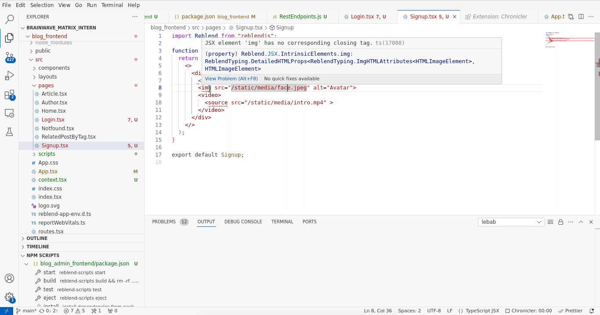

# Auto Close Empty Tag

[](https://github.com/scansio/vscode-auto-close-empty-tag/actions/workflows/main.yml)

Automatically close HTML/XML empty tags and properly close comments to support JSX syntax

## Features

* Automatically format comments to support JSX syntax
* Set the tag list that would be auto closed
* Automatically close self-closing tag
* Support Auto Close Empty Tag
* Use Keyboard Shortcut or Command Palette to run the auto close

## Usages

To run the auto close, use shortcut `Alt+c` (`Command+Alt+c` for Mac), or press `F1` and then select/type `Close Tag`



## Configuration


Add entry into `auto-close-empty-tag.activationOnLanguage` to set the languages that the extension will be activated. Use `["*"]` to activate for all languages. Below are the default settings:
```json
{
    "auto-close-empty-tag.activationOnLanguage": [
        "xml",
        "php",
        "blade",
        "ejs",
        "glimmer-js",
        "glimmer-ts",
        "jinja",
        "javascript",
        "javascriptreact",
        "typescript",
        "typescriptreact",
        "plaintext",
        "markdown",
        "vue",
        "liquid",
        "erb",
        "lang-cfml",
        "cfml",
        "HTML (Eex)"
    ]
}
```
**Note:** The setting should be set with language id defined in [VS Code](https://github.com/Microsoft/vscode/tree/master/extensions). Taking [javascript definition](https://github.com/Microsoft/vscode/blob/master/extensions/javascript/package.json) as an example, we need to use `javascript` for `.js` and `.es6`, use `javascriptreact` for `.jsx`. So, if you want to enable this extension on `.js` file, you need to add `javascript` in settings.json.

Alternatively you could also exlude the languages where you don't want the extension to be activated. Below is an example:
```json
{
    "auto-close-empty-tag.disableOnLanguage": [
        "php",
        "python"
    ]
}
```

Set the tag list that would be auto closed. Below are the default settings for empty elements in HTML per [W3C spec](https://www.w3.org/TR/html-markup/syntax.html#syntax-elements), and you could overwrite it:
```json
{
    "auto-close-empty-tag.includedTags": [
        "area",
        "base",
        "br",
        "col",
        "command",
        "embed",
        "hr",
        "img",
        "input",
        "keygen",
        "link",
        "meta",
        "param",
        "source",
        "track",
        "wbr"
    ]
}
```

## Change Log
See Change Log [here](CHANGELOG.md)

## Issues
Submit the [issues](https://github.com/scansio/vscode-auto-close-empty-tag/issues) if you find any bug or have any suggestion.

## Contribution
Fork the [repo](https://github.com/scansio/vscode-auto-close-empty-tag) and submit pull requests.

## Blog
Visit the [blog](https://blogs.msdn.microsoft.com/scansio) or the [post](https://blogs.msdn.microsoft.com/scansio/2016/06/29/auto-close-empty-tag-for-visual-studio-code/) for more detailed info 

## Special Thanks
This is a fork of [vscode-auto-close-tag](https://github.com/formulahendry/vscode-auto-close-tag) project